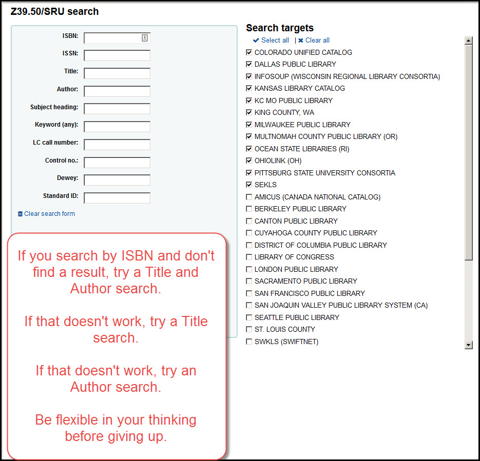

# Adding a title by Z39.50

A. First search for a title using the ["Searching for a title"](../searching-for-a-title.md) instructions.

[Click here for the "Searching for a title" instructions](../searching-for-a-title.md)

B. If a title cannot be found, go to "Cataloging" and click on the "New from Z39.50/SRU" button.

C. Fill out the form by searching for your title by ISBN, UPC, title, or author - or a combination of any of these (to search by UPC, scan the UPC code into the ISBN field) - then click on the "Search" button.

D. If you find a match, click on the "MARC" or the "Card" link to pre-view the record and make sure that the record is a good match.  Generally speaking, the more data you see on the "Card" link, the better the record.

E. Once you have chosen a record to add to our catalog, click on the "Import" link to add the record to our catalog.

F. Once the record has been imported you can make changes to the MARC record as necessary and then click the "Save" button to finalize the import.

G. After the bibliographic record has been saved, you will be redirected to the add items page so you can add your items to the new record.

[For more information about adding items, click here](../.very-basic-cataloging/adding-an-item.md)

H. If you don't find any items via a Z39.50 it is not a bad idea to repeat the search a couple of different ways.

You can re-do the search using different data.

You can select different catalogs to search in (not all catalogs are searched by default).

I. If no search returns a result, you should move on to adding a title through ShareIt.

[Click here for the "Searching for a title" instructions](./adding-a-title-from-shareit.md)
