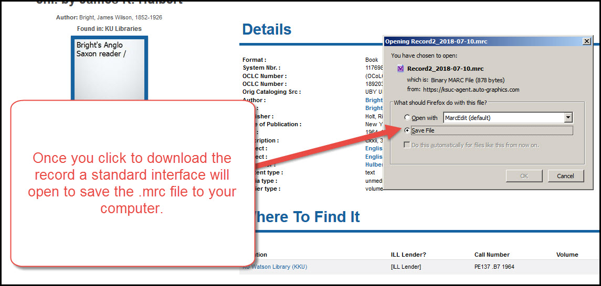

# Adding a title from ShareIt

## Search for and select the title/s to download

A. Log in to ShareIt (if you don't know how to log into ShareIt, please call NEKLS).

B. Search for a title by ISBN/UPC/Title/Author as you would for any other title.

C. Once you get a list of possible matches and find a record that matches, click on a library name to open the title's record.

D. Once the title record is open, click on the "Download record" button to download the MARC record for this title.

E. This will download the records as a file onto your computer - usually into your "Downloads" folder.

## To import the record/records into NExpress:

F. Open the Tools menu in NExpress.

G. Select "Stage marc records for import."

H. Click on "Browse" and go to the folder where the record was downloaded - usually the "Downloads" folder on your computer.

I. Select the file to import and click on "Upload file."

J. Follow the hints on the dropdown menus and click on "Stage for import."

K. Once the items are staged, click on "Manage staged records" to finish the import.

L. Click on "Import this batch into the catalog."

M. After the records have been imported, you can go to the new records by clicking on the biblio numbers in the right hand column on the import items table.

N. Once you've gone to the item's record, you can add your items by following the [Adding items instructions.](../title-already-exists/adding-an-item.md)

[For more information about adding items, click here](../title-already-exists/adding-an-item.md)
