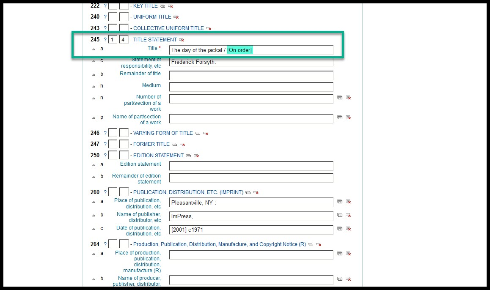
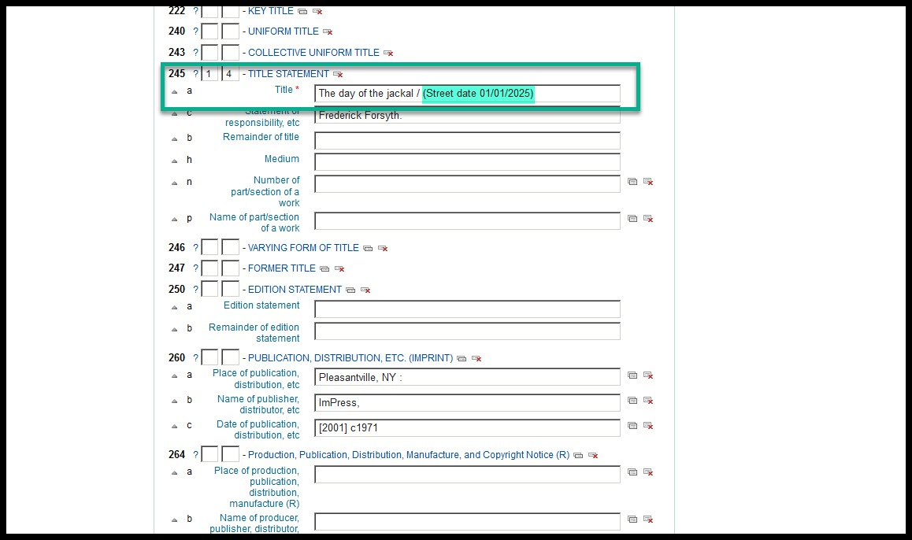
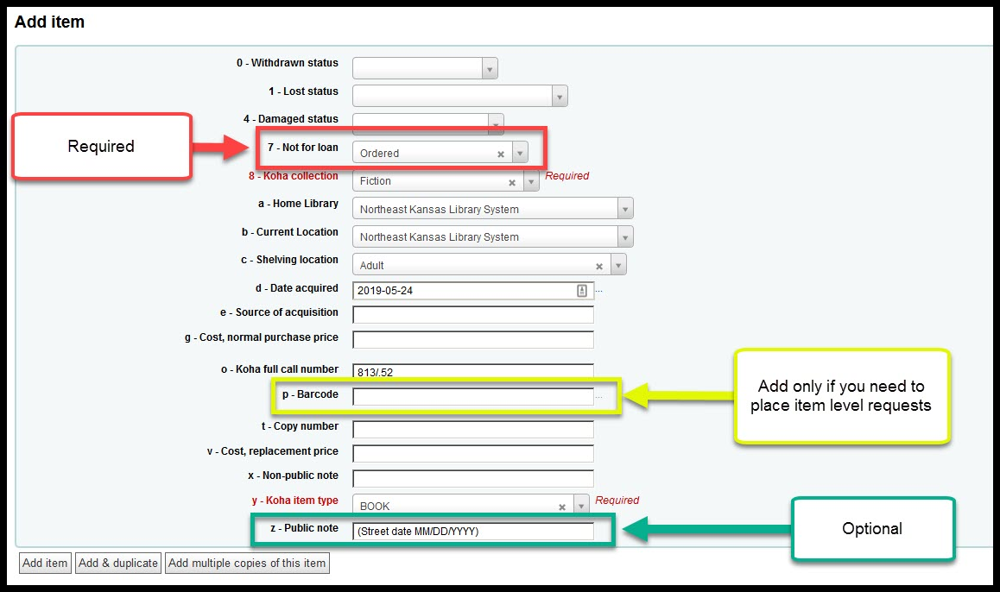
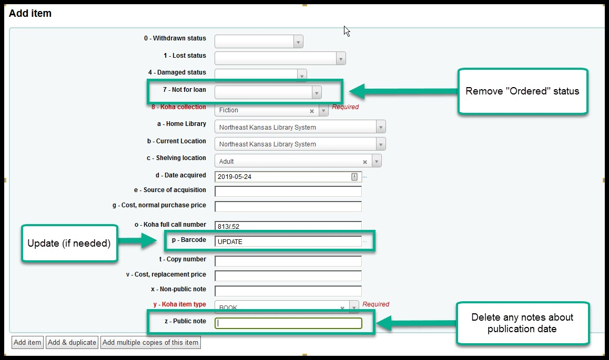

# Adding an "On order" bibliographic record for an upcoming Title

1. First search for a title using the ["Searching for a title"](../searching-for-a-title.md) instructions.

[Click here for the "Searching for a title" instructions](../searching-for-a-title.md)

2. If the title can not be found, find a bibliographic record for the title using the ["Adding a title by Z39.50"](../copy-cataloging/adding-a-title-by-z39.50) instructions or the [Adding a title from ShareIt](../copy-cataloging/adding-a-title-from-shareit.md) instructions and then proceed to the next step on this page.

3. Make the following changes to the bibliographic record:

  A. Add "[On order]" or "(Street date mm/dd/yyyy)" to the end of the 245$a field.

4. Make the following changes to the item record:

  A. Change the "Not for loan" status of the item to "Ordered" (This step is required)

  B. If you want to place item level requests on this item, you _must_ add a barcode number

  C. Add a public note to the item record indicating the publisher's release date (optional)

5. When you receive the item you need to make the following changes to the bibliographic record:
  A. Remove the "[On order]" or "(Street date mm/dd/yyyy)" notations from the 245$a field

  B. Make any other changes to the bibliographic record as needed

6. When you receive the item you need to make the following changes to the item records

  A. Remove the not for loan status

  B. If you added a barcode number, you can update that number if you wish

  C. Remove the public note indicating the release update

  D. Any other changes as necessary for cataloging the order_item

