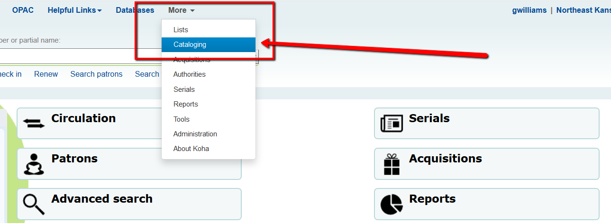
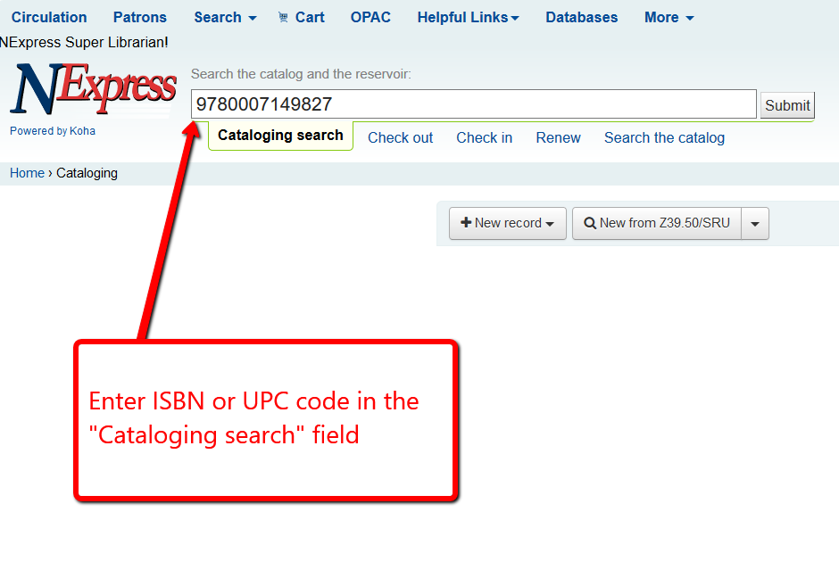
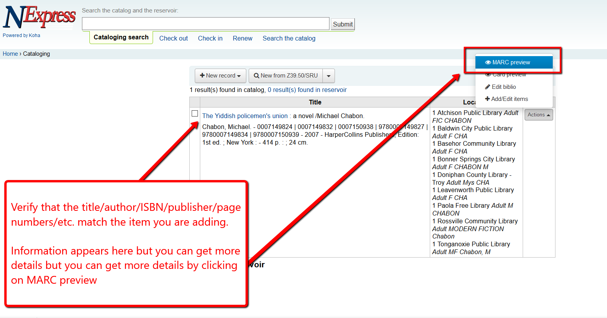
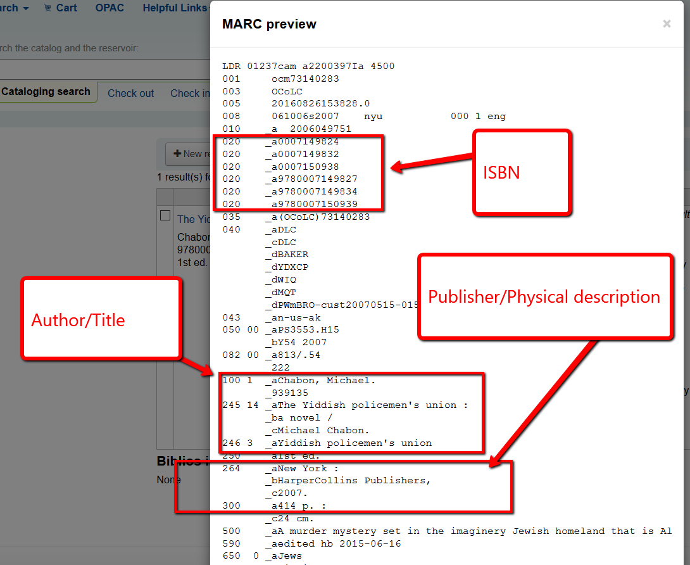
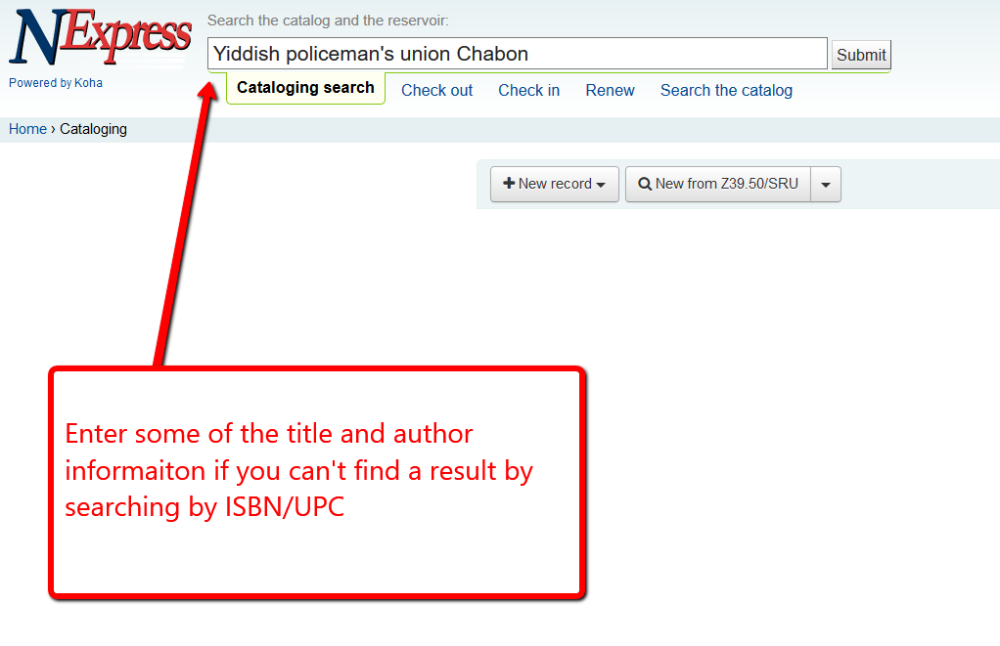

# Searching for a title

## Search by ISBN

A. Select "More &gt; Cataloging"

B. Search for the item by ISBN or or UPC number \(you can usually do this simply by scanning the UPC label on the item\).

C. If you find results, verify that the items actually match by verifying the ISBN in the 020$a, or the UPC number in the 024$a but also verify that the title, author, year, publisher, physical description \(page numbers, large print, etc.\) match.

D. If you have a match, you can just add the item you're cataloging to the existing record.

[Click here to see how to add an item to an existing record](very-basic-cataloging/adding-an-item.md)

E. If you do not find a match on the ISBN or UPC number, you should then do a search by title/author. It is possible that a copy exists that matches in every way except ISBN or UPC number. This can especially be true for items that are quite old or have been self-published.

F. If you find a match based on title/author, you should also verify that the year, publisher, physical description \(page numbers, large print, etc.\) match.

G. If you have a match, you can just add the item you're cataloging to the existing record.

[Click here to see how to add an item to an existing record](very-basic-cataloging/adding-an-item.md)

H. If you do not find a match by title/author, your next step would be to try to copy-catalog the title.

[Click here to see how to copy catalog](copy-cataloging/)

