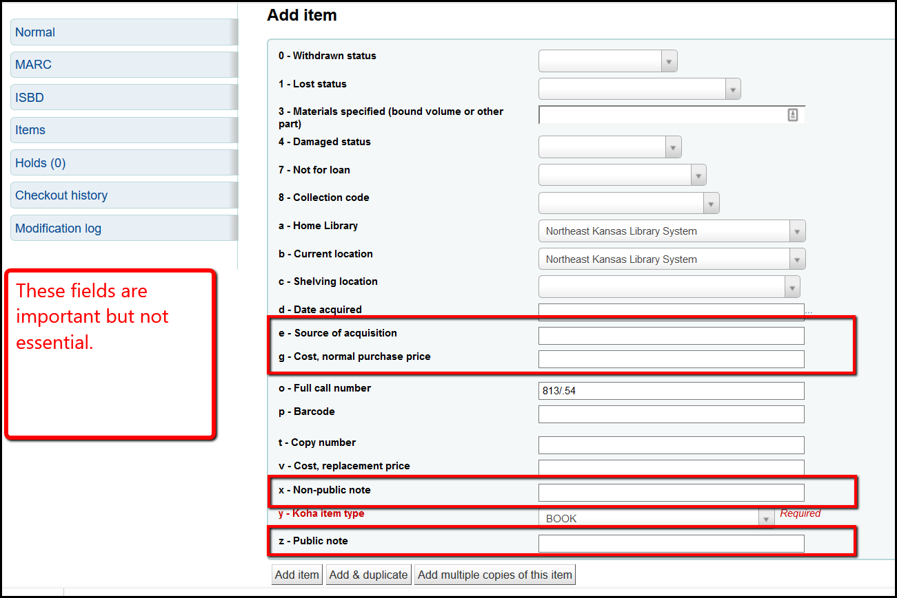
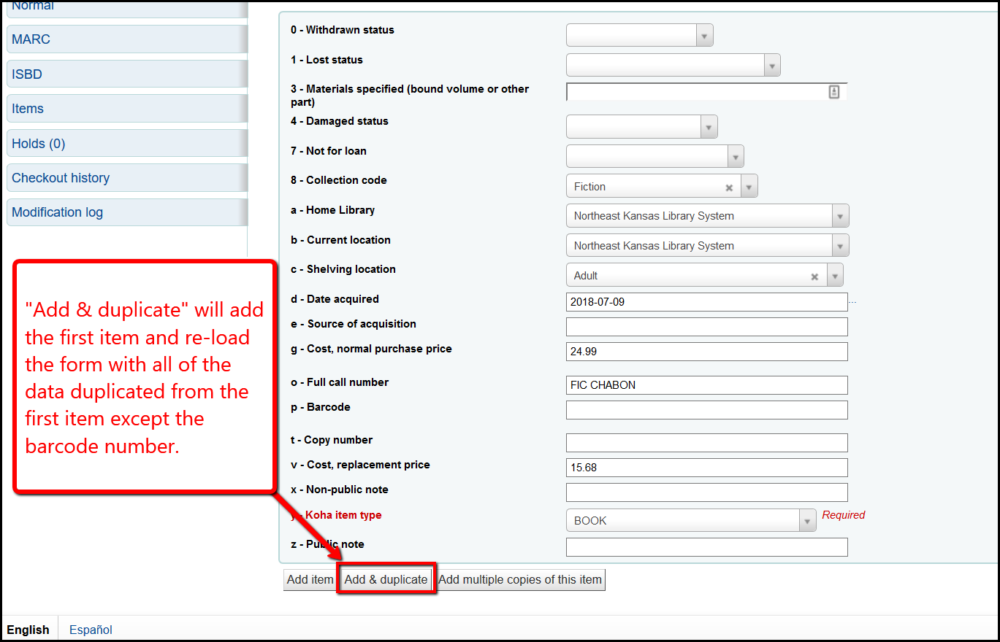
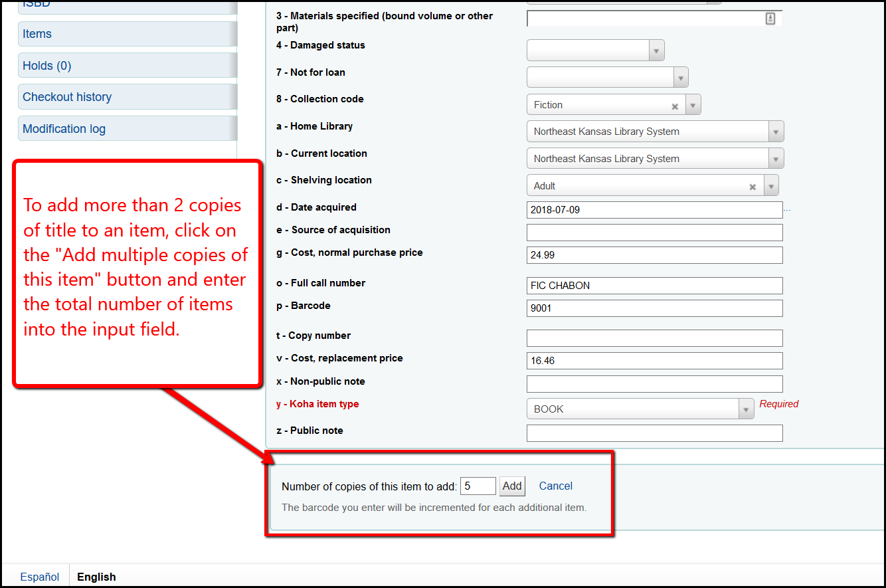

# Adding an item

## Adding a single item

A. [After searching for a title](../searching-for-a-title.md), if you find that a matching title already exists, click on the action button of that record and select + Add/Edit items.

B. On the Add/Edit screen, you must update the following fields:

* Collection code
* Home Library (should default to your library)
* Current location (should default to your library)
* Shelving location
* Call number (will default to data from 082$a)
* Barcode
* Cost, replacement price
* Koha item type

C. Additionally you can add these optional fields:

* Source of acquisition
* Cost, normal purchase price
* Copy number
* Non-public note
* Public note

D. If you only have one item to add to the record, once the fields are filled, click on "Add item" to finish adding the item.

## Adding 2 items to one records

E. If you have two copies of the same title to add to a record, once you've finished adding the first, click "Add and duplicate" to add a second copy and follow the instructions below.

The fields on the second item will match the details you updated on the first item.

## Adding more than 2 items to one records

F. If you have more than 2 copies of the same title to add to a record and your barcode numbers are in sequence (1, 2, 3, 4 . . .), once you've finished adding the first, click "Add multiple copies of this item."

A new field will open that will allow you to enter the total number of items that you're going to add to this record.

All of the items you add using this method will have barcode nubers added in sequence starting with the first number you enter.  For example, if you are adding 5 copies and the first has barcode number 1006, the items will have barcode numbers 1006, 1007, 1008, 1009, and 1010.

