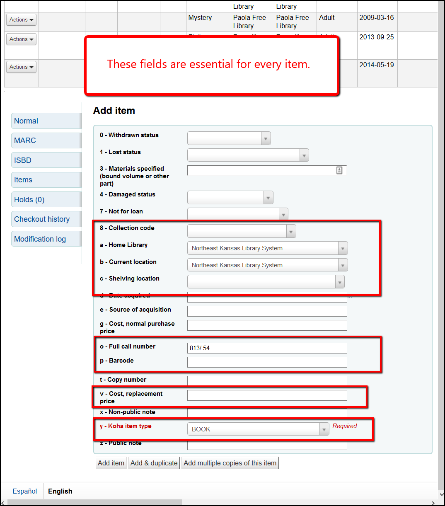

# Adding an item

## Adding a single item

A. [After searching for a title](../searching-for-a-title.md), if you find that a matching title already exists, click on the action button of that record and select + Add/Edit items.

B. On the Add/Edit screen, you must update the following fields:

* Collection code
* Home Library (should default to your library)
* Current location (should default to your library)
* Shelving location
* Call number (will default to data from 082$a)
* Barcode
* Cost, replacement price
* Koha item type

C. Additionally you can add these optional fields:

* Source of acquisition
* Cost, normal purchase price
* Copy number
* Non-public note
* Public note

D. If you only have one item to add to the record, once the fields are filled, click on "Add item" to finish adding the item.

E. If you have two copies of the same title to add to a record, once you've finished adding the first, click "Add and duplicate" to add a second copy and follow the instructions below. The fields on the second item will match the details you updated on the first item.

F. If you have more than 2 copies to add, follow the instructions at ==.

## Adding 2 items to one records

A.

B.

C.

## Adding more than 2 items to one record

A.

B.

C.
